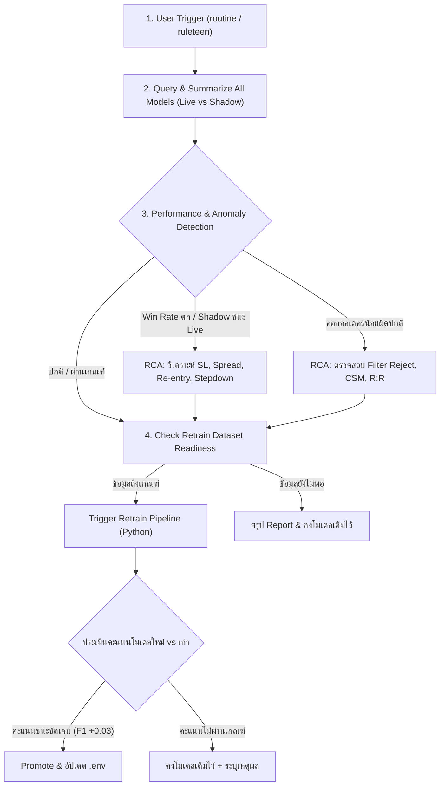

# 🤖 Trading Routine & Model Analytics Skill (`trading-routine`)

## 🎯 Purpose & Scope
เมื่อผู้ใช้ส่งคำสั่งที่มีคีย์เวิร์ด **"ruleteen"**, **"routine"**, **"รูทีน"**, **"เช็คผลโมเดล"**, **"daily check"**, หรือ **"วิเคราะห์โมเดล"** ทักษะนี้จะทำหน้าที่เป็น Protocol อัตโนมัติในการ:
1. ดึงและวิเคราะห์ผลการเทรดของทุกโมเดลในทุกตลาด (Forex, Crypto, Gold, Stock) ทั้งโหมด **Live** และ **Shadow**
2. เปรียบเทียบประสิทธิภาพแบบเคียงข้าง (Side-by-Side Comparison) ระหว่าง **Champion vs Challenger** และ **Live vs Shadow**
3. วินิจฉัยหาสาเหตุเชิงลึก (Root Cause Analysis - RCA) กรณี Win Rate ตก, Shadow ดีกว่า Live, หรือโมเดลออกออเดอร์น้อยผิดปกติ (Order Starvation)
4. ตรวจสอบความพร้อมของ Dataset และสั่ง **Retrain โมเดลใหม่อัตโนมัติ** หากข้อมูลถึงเกณฑ์ พร้อมประเมินเกณฑ์ชี้ขาดก่อนนำมาใช้งานจริง

---

## ⚡ Quick Execution Command

เมื่อเริ่มกระบวนการ Routine ให้รันสคริปต์วิเคราะห์ข้อมูลหลักทันที:
```powershell
node scripts/trading_routine_report.js
```
สคริปต์นี้จะสรุป Performance Matrix, Exit Breakdown, สถานะ ML Observations Dataset, และประเมินความพร้อม Retrain ให้ในคำสั่งเดียว

---

## 📋 4-Step Routine Execution Protocol



---

## 🔍 Step 1: Data Gathering & SQL Queries Reference

หากต้องการวิเคราะห์เจาะลึกเฉพาะจุด ให้ใช้ SQL Query ต่อไปนี้:

### 1.1 ประสิทธิภาพรวมแยกตามตลาด, โหมด (Live/Shadow), และ Model Version (7 วันล่าสุด)
```sql
SELECT
  market_type,
  CASE
    WHEN decision_mode IN ('LIVE', 'FOREX_SIGNAL_REENTRY', 'FOREX_SCALE_IN', 'FREQTRADE_MT5_LIVE', 'TEST_LIVE') THEN 'LIVE'
    ELSE 'SHADOW'
  END as run_mode,
  COALESCE(model_source, 'unknown') as model_src,
  COALESCE(model_version, 'legacy/default') as model_ver,
  COUNT(*) as total_orders,
  SUM(CASE WHEN exit_reason != 'OPEN' AND exit_price IS NOT NULL THEN 1 ELSE 0 END) as closed_orders,
  SUM(CASE WHEN exit_reason != 'OPEN' AND (is_win = 1 OR profit_loss > 0 OR pips > 0) THEN 1 ELSE 0 END) as wins,
  SUM(CASE WHEN exit_reason != 'OPEN' AND (is_win = 0 OR profit_loss < 0 OR pips < 0) THEN 1 ELSE 0 END) as losses,
  ROUND(
    SUM(CASE WHEN exit_reason != 'OPEN' AND (is_win = 1 OR profit_loss > 0 OR pips > 0) THEN 1 ELSE 0 END) * 100.0 /
    NULLIF(SUM(CASE WHEN exit_reason != 'OPEN' AND exit_price IS NOT NULL THEN 1 ELSE 0 END), 0),
    2
  ) as win_rate_pct,
  ROUND(SUM(CASE WHEN exit_reason != 'OPEN' THEN profit_loss ELSE 0 END), 2) as net_usd,
  ROUND(SUM(CASE WHEN exit_reason != 'OPEN' THEN pips ELSE 0 END), 2) as net_pips,
  ROUND(
    ABS(SUM(CASE WHEN exit_reason != 'OPEN' AND profit_loss > 0 THEN profit_loss ELSE 0 END)) /
    NULLIF(ABS(SUM(CASE WHEN exit_reason != 'OPEN' AND profit_loss < 0 THEN profit_loss ELSE 0 END)), 0),
    2
  ) as profit_factor,
  ROUND(AVG(CASE WHEN exit_reason != 'OPEN' THEN hold_duration_minutes ELSE NULL END), 1) as avg_hold_mins
FROM trade_results
WHERE entry_time >= DATE_SUB(NOW(), INTERVAL 7 DAY)
GROUP BY market_type, run_mode, model_src, model_ver
ORDER BY market_type ASC, run_mode ASC, total_orders DESC;
```

### 1.2 เหตุผลการปิดออเดอร์ (Exit Reason Breakdown)
```sql
SELECT
  market_type,
  CASE
    WHEN decision_mode IN ('LIVE', 'FOREX_SIGNAL_REENTRY', 'FOREX_SCALE_IN', 'FREQTRADE_MT5_LIVE', 'TEST_LIVE') THEN 'LIVE'
    ELSE 'SHADOW'
  END as run_mode,
  exit_reason,
  COUNT(*) as count,
  ROUND(SUM(profit_loss), 2) as sum_usd,
  ROUND(SUM(pips), 2) as sum_pips
FROM trade_results
WHERE entry_time >= DATE_SUB(NOW(), INTERVAL 7 DAY) AND exit_reason != 'OPEN'
GROUP BY market_type, run_mode, exit_reason
ORDER BY market_type ASC, run_mode ASC, count DESC;
```

### 1.3 สถิติชุดข้อมูล ML Observations สำหรับ Retrain
```sql
SELECT
  outcome_status,
  COUNT(*) as total_count,
  SUM(CASE WHEN target_buy = 1 THEN 1 ELSE 0 END) as buy_targets,
  SUM(CASE WHEN target_sell = 1 THEN 1 ELSE 0 END) as sell_targets,
  MIN(observed_at) as earliest_sample,
  MAX(observed_at) as latest_sample
FROM forex_ml_observations
GROUP BY outcome_status;
```

---

## 📊 Step 2: Comparative Analysis Matrix

รายงานสรุปต้องจัดทำตารางเปรียบเทียบใน 2 มิติสำคัญ:

### 2.1 มิติที่ 1: Champion vs Challenger (Model Architecture Comparison)
| ตัวชี้วัด (Metric) | Champion Model | Challenger Model | ผลต่าง ($\Delta$) | สรุปผล |
| :--- | :--- | :--- | :--- | :--- |
| **Model Version** | `v1.6.0` (GBDT Baseline) | `challenger-v1.7.0` (Calibrated Ensemble) | - | - |
| **Total Trades** | จำนวนออเดอร์ | จำนวนออเดอร์ | $\pm N$ | โมเดลใดเลือกเทรดแม่นยำกว่า |
| **Win Rate (%)** | $XX.X\%$ | $YY.Y\%$ | $\pm Z\%$ | ชนะเพิ่มขึ้น/ลดลง |
| **Profit Factor (PF)** | $1.XX$ | $1.YY$ | $\pm P$ | ความคุ้มค่าของผลกำไรเทียบขาดทุน |
| **Net USD ($)** | $\$XX.XX$ | $\$YY.YY$ | $\pm \$D$ | กำไรสุทธิ |
| **Avg Duration** | $X$ นาที | $Y$ นาที | $\pm M$ นาที | ความไวในการทำกำไร |

### 2.2 มิติที่ 2: Live vs Shadow (Execution & Strategy Comparison)
*เปรียบเทียบผลลัพธ์ของโมเดลตัวเดียวกันระหว่างการรันบนเงินจริง (Live) กับการรันจำลอง (Shadow)*
- **ถ้า Shadow ชนะแต่ Live แพ้**: แสดงว่ามีปัญหาด้าน Execution, Spread, SL แคบเกินไป หรือ Re-entry ที่ต้องแก้ไขทันที

---

## 🩺 Step 3: Automated Root Cause Analysis (RCA)

เมื่อพบความผิดปกติ ให้วิเคราะห์และระบุสาเหตุตามหมวดหมู่ดังนี้:

### 🚨 ปัญหาที่ 1: Shadow มีกำไร แต่ Live ขาดทุน หรือ Live Win Rate ตกฮวบ
| สาเหตุหลักที่พบบ่อย (Root Cause) | อาการที่ตรวจพบในข้อมูล | แนวทางแก้ไขและป้องกัน |
| :--- | :--- | :--- |
| **1. Dynamic Stop Loss แคบเกินไป (ATR Buffer Too Tight)** | สัดส่วน `CLOSED_SL` สูงผิดปกติ (>60%) โดยถือครองเฉลี่ยเพียง 1–3 นาที | ปรับ `FOREX_DYNAMIC_SL_ATR_MULT` จาก 0.8 เป็น **1.4** และขยาย Min SL Buffer (Major $\ge 5.5$ pips, JPY $\ge 8.0$ pips) เพื่อป้องกัน Noise |
| **2. กับดัก Spread และ Slippage (Spread Trap)** | กำไรเฉลี่ยต่อไม้ไม่ครอบคลุมค่า Spread ของโบรกเกอร์ (1.2–2.5 pips) | บังคับเช็ค `spread_to_atr <= 0.45` และขยาย Target TP ขั้นต่ำให้ $\ge 2.5$ pips |
| **3. Toxic Signal Re-entry / Scale-In** | โดน Stop Loss ซ้ำในทิศทางเดิมหลายไม้ติดกันเมื่อตลาดเกิด Flash Move | ปิด `FOREX_REENTRY_ENABLED=false` และ `FOREX_SCALE_IN_ENABLED=false` |
| **4. Stepdown Trailing Lock ช้าเกินไป** | ราคาเคยวิ่งบวกไปแล้ว แต่กลับตัวลงมาชน SL เพราะรอนานเกินไป | ลด `FOREX_STEPDOWN_MAX_MINUTES` เหลือ **6 นาที** เพื่อล็อกกำไรต้นไม้ |

### 📉 ปัญหาที่ 2: โมเดลออกออเดอร์น้อยผิดปกติ (Order Starvation)
| สาเหตุหลักที่พบบ่อย (Root Cause) | อาการที่ตรวจพบในข้อมูล | แนวทางแก้ไขและป้องกัน |
| :--- | :--- | :--- |
| **1. 1st-Stage Filter ตัดทิ้งหมด (Over-Filtering)** | ติด reject `EMA Chop`, `Supertrend Mismatch`, หรือ `|CSM| < 0.20` เกือบ 100% | ตรวจสอบว่าตลาดเข้าสู่ภาวะ Sideway พักตัวรุนแรง หรือเกณฑ์ CSM ตั้งไว้ตึงเกินไป |
| **2. Dynamic Exit R:R ไม่ผ่านเกณฑ์** | ติด reject `พื้นที่ถึงเป้าหมายไม่พอ (< 2.5 pips)` หรือ `R:R ต่ำเกณฑ์ (< 1:0.75)` | เกิดจากจุดเข้าอยู่ใกล้แนวรับ/แนวต้านสำคัญมากเกินไป ปล่อยให้ระบบรอแท่ง Breakout |
| **3. Model Confidence Threshold สูงเกินไป** | โมเดลให้ค่าความมั่นใจ 50–70% แต่ระบบตั้งรับเฉพาะ $\ge 85\%$ | ปรับจูน Signal Confidence Threshold ให้เหมาะสมตาม Calibration Curve |

### ⚠️ ปัญหาที่ 3: Win Rate ต่ำทั้ง Live และ Shadow (< 45%)
- **Market Regime Shift**: ตลาดเปลี่ยนจาก Trending เป็น High-Volatility Chop หรือมีข่าวเศรษฐกิจรุนแรง (NFP, FOMC, CPI)
- **Feature Decay**: รูปแบบราคาในอดีตเริ่มไม่สอดคล้องกับพฤติกรรมตลาดปัจจุบัน จำเป็นต้อง Retrain โมเดลใหม่

---

## 🚀 Step 4: Autonomous Retraining & Promotion Rules

### 4.1 เกณฑ์การสั่ง Retrain อัตโนมัติ (Retrain Trigger Criteria)
ให้ตรวจสอบความพร้อมของ Dataset ตามเงื่อนไขต่อไปนี้:
1. **Forex Model**:
   - `forex_ml_observations` มีแถว `LABELED` $\ge \mathbf{200}$ แถว **หรือ**
   - `trade_results` (Forex) มีออเดอร์ที่ปิดสมบูรณ์ $\ge \mathbf{150}$ รายการ
2. **Crypto Model**:
   - `trade_results` (Crypto) มีออเดอร์ที่ปิดสมบูรณ์ $\ge \mathbf{100}$ รายการ

### 4.2 คำสั่งสั่ง Retrain แต่ละโมเดล
เมื่อข้อมูลครบเกณฑ์ ให้สั่งรันการ Retrain ทันที:
```powershell
# Retrain Forex Challenger Model (Ensemble / GBDT)
python scripts/train_forex_challenger_model.py

# Retrain Crypto Multi-Model / RL Model
python scripts/train_crypto_m5_model.py

# Retrain Range-bound Model (ถ้ามี)
python scripts/train_forex_range_model.py
```

### 4.3 🏆 เกณฑ์การประเมินและตัดสินใจนำโมเดลใหม่มาใช้ (Strict Promotion Threshold)
ห้ามนำโมเดลใหม่มาใช้งานจริงหากคะแนนไม่ผ่านเกณฑ์ชี้ขาดดังต่อไปนี้:

| เกณฑ์การประเมิน (Evaluation Metric) | เงื่อนไขผ่านเกณฑ์ (Pass Threshold) | เหตุผล |
| :--- | :--- | :--- |
| **1. $\Delta$ F1-Score / F2-Score** | $\ge \mathbf{+0.03}$ (สูงกว่าโมเดลเดิมอย่างชัดเจน) | ป้องกัน Overfitting และยืนยันว่าการจับสัญญาณดีขึ้นจริง |
| **2. High-Confidence Precision** | $\ge \mathbf{60.0\%}$ บน Out-of-Sample Test | ยืนยันว่าไม้ที่มั่นใจสูงมีอัตราชนะจริง |
| **3. Brier Score / Log Loss** | **ลดลง** อย่างน้อย 5% เทียบกับโมเดลเดิม | ความน่าจะเป็น (Calibrated Probability) สอดคล้องกับความเป็นจริงมากขึ้น |
| **4. Max Drawdown ใน Backtest** | $\le \mathbf{12.0\%}$ | ป้องกันกลยุทธ์ที่มีความเสี่ยงสูงเกินรับได้ |

### 4.4 การดำเนินการเมื่อผลประเมินสรุปออกมา:
* **กรณีผ่านเกณฑ์ (Promote Success):**
  1. อัปเดต Model Version และ Registry ใน [python/models/](file:///C:/xampp/htdocs/trade_bot/python/models)
  2. อัปเดต Model Version ใน [.env](file:///C:/xampp/htdocs/trade_bot/.env) (เช่น `FOREX_CHALLENGER_MODEL_VERSION=challenger-v1.8.0`)
  3. หากผลทดสอบใน Shadow ชนะ Champion ต่อเนื่อง ให้ปรับ `FOREX_PRIMARY_MODEL_ROLE=challenger`
  4. บันทึก Changelog และแจ้งผลให้ผู้ใช้ทราบ
* **กรณีไม่ผ่านเกณฑ์ (Reject / Hold):**
  1. คงโมเดลเดิมไว้ในระบบ Live และ Shadow
  2. สรุปคะแนนเปรียบเทียบและชี้แจงจุดที่โมเดลใหม่ยังไม่ผ่านเกณฑ์ (เช่น F1 ต่ำกว่าเดิม หรือ Precision ไม่ถึงเป้า)

---

## 📝 Routine Report Output Template

เมื่อทำ Routine เสร็จสมบูรณ์ ให้จัดพิมพ์รายงานตามโครงสร้างมาตรฐานนี้:

```markdown
# 📈 รายงานผลการตรวจเช็คระบบและโมเดลประจำวัน (Daily Routine Report)

### 1. 📊 สรุปผลการเทรดภาพรวม (7 วันล่าสุด)
[ตารางสรุป Performance Matrix แยกตาม Market, Mode, Model]

### 2. ⚔️ ผลการเปรียบเทียบ Champion vs Challenger & Live vs Shadow
[ตารางเปรียบเทียบพร้อมวิเคราะห์จุดแข็ง-จุดอ่อน]

### 3. 🔍 การวินิจฉัยสาเหตุเชิงลึก (Root Cause Analysis)
- **สถานะ Win Rate / Drawdown:** [วิเคราะห์ผลและชี้จุดผิดปกติ]
- **การออกออเดอร์ (Order Frequency):** [วิเคราะห์ Filter และเหตุผลการ Reject]
- **ปัจจัยด้าน Execution & Risk:** [วิเคราะห์ SL, Spread, Re-entry, Stepdown]

### 4. 🧪 สถานะ Dataset & การ Retrain โมเดล
- **Forex Labeled Samples:** [จำนวน] แถว (เกณฑ์: 200) -> [พร้อม / รอข้อมูล]
- **Crypto Closed Trades:** [จำนวน] รายการ (เกณฑ์: 100) -> [พร้อม / รอข้อมูล]
- **ผลการ Retrain (ถ้ามีการสั่งรัน):** [คะแนนโมเดลใหม่ vs เก่า และการตัดสินใจ Promote/Hold]

### 5. 🎯 ข้อเสนอแนะและขั้นตอนถัดไป (Action Items)
1. [การปรับ Config หรือ Tuning Parameters]
2. [แผนการ Retrain หรือการเฝ้าระวังตลาด]
```

---

## 📚 Knowledge Base & References in this Skill
- **Gold Trading Bible & Microstructure Knowledge**: [`references/gold_trading_knowledge.md`](file:///C:/xampp/htdocs/trade_bot/.agents/skills/trading-routine/references/gold_trading_knowledge.md) — คัมภีร์องค์ความรู้ตลาดทองคำ (XAUUSD), พฤติกรรมสภาพคล่องตามเซสชัน, รูปแบบ Price Action / Liquidity Sweep, จิตวิทยาการเทรด และพิมพ์เขียว 12 ฟีเจอร์สำหรับพัฒนา AI Model
- **Crypto Trading & Microstructure Bible**: [`references/crypto_trading_knowledge.md`](file:///C:/xampp/htdocs/trade_bot/.agents/skills/trading-routine/references/crypto_trading_knowledge.md) — คัมภีร์องค์ความรู้ตลาดคริปโท 24/7 (BTC, ETH, SOL), Perpetual Futures, Funding Rates, Liquidation Cascades, CVD, BTC Beta & Dominance, จิตวิทยาตลาด และพิมพ์เขียว 16 ฟีเจอร์สำหรับพัฒนา Next-Gen Crypto AI Model


