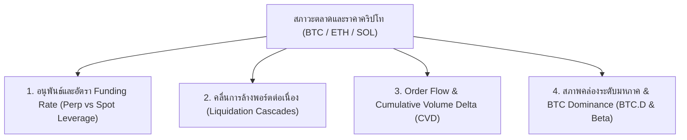
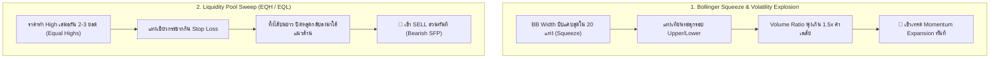
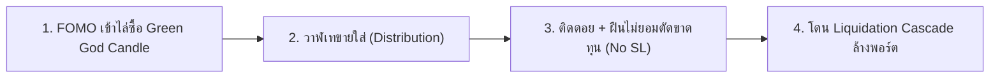
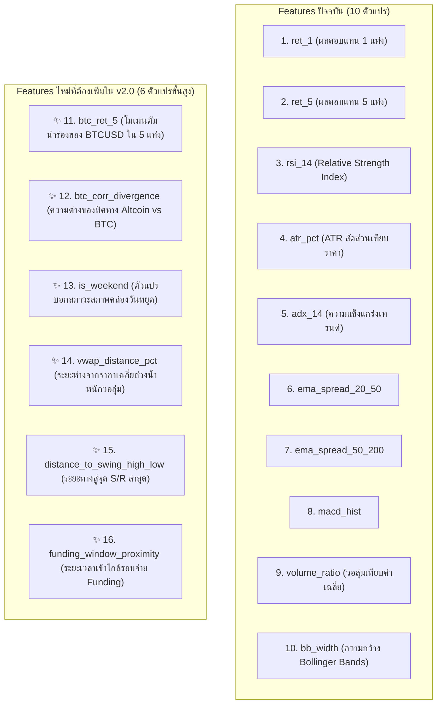

# 🪙 คัมภีร์องค์ความรู้และโครงสร้างตลาดคริปโทเคอร์เรนซี (The Ultimate Crypto Trading & Microstructure Bible)

เอกสารรวบรวมองค์ความรู้เชิงลึก โครงสร้างสภาพคล่อง (Microstructure), Order Flow, อนุพันธ์ (Perpetuals & Funding Rates), ปัจจัยมหภาค, จิตวิทยาตลาด และ **การวิเคราะห์เปรียบเทียบเชิงโครงสร้างกับโมเดล AI ปัจจุบัน** (Gap Analysis & Next-Gen Blueprint) สำหรับระบบเทรดคริปโทอัตโนมัติ 24/7 (`BTCUSD`, `ETHUSD`, `SOLUSD`)

---

## 🧭 สารบัญเนื้อหา (Table of Contents)
1. [ธรรมชาติและโครงสร้างตลาดคริปโท (Crypto Market Microstructure & Ecosystem Dynamics)](#1-ธรรมชาติและโครงสร้างตลาดคริปโท)
2. [พิมพ์เขียวสภาพคล่องและวงจรเวลา 24/7 (24/7 Liquidity Cycles & Temporal Regimes)](#2-พิมพ์เขียวสภาพคล่องและวงจรเวลา-247)
3. [พฤติกรรมกราฟ Price Action & Order Flow Patterns ในตลาดคริปโท](#3-พฤติกรรมกราฟ-price-action--order-flow-patterns)
4. [จิตวิทยาการเทรดคริปโทและกับดักที่พบบ่อย (Crypto Psychology & Retail Pitfalls)](#4-จิตวิทยาการเทรดคริปโทและกับดักที่พบบ่อย)
5. [กฎเหล็กการบริหารความเสี่ยงและ Stop Loss ในตลาดคริปโท](#5-กฎเหล็กการบริหารความเสี่ยงและ-stop-loss-ในตลาดคริปโท)
6. [การวิเคราะห์เปรียบเทียบโมเดลปัจจุบัน vs คัมภีร์คริปโท (Current Model vs Bible Gap Analysis)](#6-การวิเคราะห์เปรียบเทียบโมเดลปัจจุบัน-vs-คัมภีร์คริปโท)
7. [พิมพ์เขียวฟีเจอร์สำหรับพัฒนา AI Crypto Model ยุคถัดไป (Next-Gen Feature Engineering Blueprint)](#7-พิมพ์เขียวฟีเจอร์สำหรับพัฒนา-ai-crypto-model-ยุคถัดไป)
8. [Checklist การตรวจสอบก่อนออกคำสั่งเทรดคริปโท (Pre-Trade Execution Checklist)](#8-checklist-การตรวจสอบก่อนออกคำสั่งเทรดคริปโท)

---

## 1. ธรรมชาติและโครงสร้างตลาดคริปโท (Crypto Market Microstructure & Ecosystem Dynamics)

ตลาดคริปโทเคอร์เรนซีมีความแตกต่างอย่างมีนัยสำคัญจาก Forex และหุ้นแบบดั้งเดิม โดยถูกขับเคลื่อนด้วย **อนุพันธ์สัญญาไร้กำหนดอายุ (Perpetual Futures)**, **อัตราดอกเบี้ยระดมทุน (Funding Rates)**, และ **การล้างพอร์ตอัตโนมัติ (Liquidation Cascades)**:

### 1.1 สัญญา Perpetual Futures และ อัตรา Funding Rate (The Funding Anchor)
* **กลไก Funding Rate**: เป็นค่าธรรมเนียมที่จ่ายระหว่างฝั่ง Long และ Short ทุกๆ 8 ชั่วโมง (00:00, 08:00, 16:00 UTC) เพื่อดึงราคา Perpetual Futures ให้ผูกติดกับราคา Spot จริง
  * **Positive Funding Rate (ค่าบวกสูง > +0.03%)**: ฝั่ง Long ยอมจ่ายเงินให้ฝั่ง Short $\rightarrow$ ตลาด Overheated / มีความโลภสะสม เสี่ยงต่อการเกิด **Long Squeeze (ทุบให้ Long แตก)**
  * **Negative Funding Rate (ค่าลบ < -0.02%)**: ฝั่ง Short จ่ายเงินให้ Long $\rightarrow$ ตลาดเกิด Fear / Overcrowded Short เสี่ยงต่อการเกิด **Short Squeeze (ลากให้ Short โดน Liquidate)**
* **Spot-Perp Divergence (สัญญาณแท้ vs ฟองสบู่ Leverage)**:
  * หากราคาพุ่งขึ้นโดยมี **Spot Buying นำ** = เทรนด์แท้จริง มีความยั่งยืนสูง
  * หากราคาพุ่งขึ้นแต่ขับเคลื่อนด้วย **Perp Open Interest พุ่ง แต่ Spot นิ่ง** = เป็นการดันด้วย Leverage เสี่ยงโดนดัมพ์เทกลับอย่างรุนแรง

### 1.2 วงจรการล้างพอร์ตต่อเนื่อง (Liquidation Cascades & Stop Hunts)
* ในตลาดคริปโท รายย่อยใช้เลเวอเรจสูง (10x–100x) ทำให้มีระดับ **Liquidation Price** และ Stop Loss กองรวมกันเป็นกลุ่มก้อนหนาแน่น (Liquidation Clusters)
* เมื่อราคาวิ่งชนกลุ่มก้อนเหล่านี้ ระบบ Exchange จะบังคับปิดคำสั่งเป็น **Market Order ทันที** ส่งผลให้เกิดแรงซื้อ/ขายทะลัก ดันราคาไปชน Liquidation ชั้นถัดไปเป็นลูกโซ่ (**Cascade Effect**)

### 1.3 Order Flow, CVD (Cumulative Volume Delta) & Absorption
* **Cumulative Volume Delta (CVD)**: ผลรวมสุทธิของปริมาณซื้อขายที่เคาะขวาราคาตลาด (Market Buy vs Market Sell)
* **Absorption Divergence (การดูดซับสภาพคล่อง)**: 
  * เมื่อราคาทำ Lower Low แต่ CVD ทำ Higher Low = วาฬตั้ง Limit Buy รับของทั้งหมด (Passive Absorption) $\rightarrow$ สัญญาณเตรียมกลับตัวรุนแรง
  * เมื่อราคาทำ Higher High แต่ CVD ลดลงหรือไม่ทำจุดสูงสุดใหม่ = ขาดแรงซื้อจริง เป็นเพียงการลากไปเชือด

### 1.4 โครงสร้างสายสัมพันธ์ (BTC Dominance & Altcoin Beta)
* **Bitcoin (BTC)** คือเข็มทิศทิศทางของตลาดทั้งหมด (`Beta = 1.0`):
  * **BTC.D พุ่ง + BTC ขึ้น**: สภาพคล่องดูดเข้า BTC เหรียญ Altcoin (ETH, SOL) มักขึ้นช้ากว่าหรือร่วงสวนทาง
  * **BTC Sideway กรอบแคบ + BTC.D ลดลง**: สัญญาณ **Altseason / High Beta Expansion** $\rightarrow$ ETH และ SOL มีแนวโน้มทำรอบกำไรได้กว้างกว่า (Higher Highs & Higher ATR)
  * **BTC ทุบหลุดแนวรับหลัก**: Altcoin ทุกตัวจะถูกเทขายรุนแรง (Beta 1.5x - 2.5x) ไม่ควรเปิด Long สวน

---

## 2. พิมพ์เขียวสภาพคล่องและวงจรเวลา 24/7 (24/7 Liquidity Cycles & Temporal Regimes)

แม้ตลาดคริปโทจะเปิด 24 ชั่วโมง 7 วัน แต่สภาวะสภาพคล่องและพฤติกรรมมีความแตกต่างกันตามช่วงเวลาของโลก (อิงเวลาไทย GMT+7):

| ช่วงเวลา (GMT+7) | ช่วงเวลาสากล (UTC) | ชื่อเซสชัน / เหตุการณ์สำคัญ | พฤติกรรมตลาดคริปโท | กลยุทธ์การเทรดที่เหมาะสม |
| :--- | :--- | :--- | :--- | :--- |
| **07:00 - 08:30 น.** | `00:00 - 01:30 UTC` | **Daily Close & Funding Reset** | ปิดแท่ง Daily กราฟโลก, จ่ายรอบ Funding Rate, วาฬมักทดสอบทำ Low/High แรกของวัน | ระวังความผันผวนช่วงเปลี่ยนวัน / สังเกตทิศทาง Daily Bias |
| **08:30 - 14:00 น.** | `01:30 - 07:00 UTC` | **Asian Market Session** | สภาพคล่องระดับกลาง มักเป็นการสร้างฐานราคา (Range Accumulation) หรือการเทรดแบบ Mean Reversion | เล่นตามกรอบ S/R หรือรอสัญญาณ Breakout ที่มี Volume ยืนยัน |
| **14:00 - 19:30 น.** | `07:00 - 12:30 UTC` | **London Crypto Session** | วอลุ่มยุโรปเข้า มีการกวาดสภาพคล่องกรอบเอเชีย (Asian High/Low Sweeps) | ดักจังหวะ **Liquidity Sweep & Breakout Continuation** |
| **19:30 - 03:00 น.** | `12:30 - 20:00 UTC` | **US Trading & Spot ETF Flows** | **ช่วงพีคที่สุดของวัน (Maximum Liquidity & Volatility)** สถาบันสหรัฐฯ ซื้อขาย ETF เงินทุนไหลเข้าออกสูงสุด | เทรดเกาะเทรนด์ใหญ่ (**Trend Rider & Volatility Expansion**) |
| **03:00 - 07:00 น.** | `20:00 - 00:00 UTC` | **Late US / Pacific Lull** | วอลุ่มเริ่มชะลอตัว กราฟมักแกว่งกลับหาเส้นค่าเฉลี่ย (Mean Reversion) | ระวัง False Breakout ลดขนาดไม้ หรือเปิดล็อค Trailing Stop |
| **เสาร์ - อาทิตย์** | `Weekend UTC` | **Weekend Illiquidity Regime** | ⚠️ **สภาพคล่องสถาบันแห้ง (CME/ETF ปิด)** วาฬคุมราคาง่าย กราฟมักเกิด Bart Simpson Pattern (ลากขึ้นแล้วตบกลับที่เดิม) | 🛡️ **กฎความปลอดภัย: ต้องลดขนาด Lot 50% หรือเข้มงวด Volume Ratio $\ge 1.25$** |

---

## 3. พฤติกรรมกราฟ Price Action & Order Flow Patterns

### 3.1 รูปแบบ Bollinger Band Squeeze & Volatility Explosion
* คริปโทมีพฤติกรรมสะสมพลังแบบ **"บีบแล้วระเบิด" (Compression to Expansion)**
* เมื่อ BandWidth บีบตัวต่ำกว่าค่าเฉลี่ย 20 แท่งย้อนหลัง และแท่งเทียนปิดทะลุกรอบพร้อม Volume Spikes ($\ge 1.25\times\text{Avg}$) แสดงถึงการเริ่มรอบเทรนด์ใหม่แบบระเบิดตัว
* **จุดตัดขาดทุน (SL)**: ตั้งไว้ที่เส้นกลาง BB (EMA 20) หรือขอบล่างของ Squeeze Range

### 3.2 รูปแบบการล่าสภาพคล่อง (Liquidity Pool Sweeps: EQH / EQL)
* **Equal Highs (EQH)**: เมื่อกราฟทำยอดต้านเท่ากัน 2-3 จุด รายย่อยจะตั้ง Stop Loss และ Buy Stop ไว้เหนือยอดนั้น
* **The Hunt**: วาฬจะดันราคาขึ้นไปกินสภาพคล่องเหล่านั้นเพื่อจับคู่กับคำสั่งขายขนาดใหญ่ของตน (Offloading) จากนั้นราคาจะทิ้งตัวลงอย่างรวดเร็ว
* **สัญญาณเข้าเทรด**: รอให้เกิด Swing Failure Pattern (SFP) หรือไส้เทียนยาว $\ge 50\%$ แล้วปิดต่ำกว่าแนวต้าน

### 3.3 รูปแบบ Bart Simpson Pattern (Manipulation in Low Liquidity)
* มักเกิดในวันเสาร์-อาทิตย์ หรือช่วงดึก: ราคาพุ่งขึ้นแท่งเขียว 1 แท่ง $\rightarrow$ วิ่งราบเรียบด้านบนหลายชั่วโมง $\rightarrow$ ทิ้งตัวแท่งแดงดิ่งลงมาที่จุดเริ่มต้นเดิม
* **วิธีป้องกัน**: ในช่วงวันหยุดสุดสัปดาห์ ห้ามไล่ราคาเขียวแท่งแรก ให้รอ Pullback หรือยืนยันด้วย Volume โครงสร้าง

---

## 4. จิตวิทยาการเทรดคริปโทและกับดักที่พบบ่อย (Crypto Psychology & Retail Pitfalls)

### 4.1 กับดัก "Green God Candle FOMO"
* **พฤติกรรม**: เห็นแท่งเทียน M5 พุ่งทะลุ $1,000 ใน BTC หรือ $10 ใน SOL แล้วกลัวตกรถ จึงกด Market Buy ที่ยอดแท่ง
* **ความจริง**: แท่งเทียนที่วิ่งชันเกินไป (Parabolic) มีโอกาสย่อตัว (Mean Reversion) กลับมาหา EMA 20 ถึง 80% การเข้าที่ยอดทำให้ตั้ง SL ได้ยากและเสียเปรียบ R:R อย่างมาก

### 4.2 กับดัก Counter-Trend Without Volume Divergence (สวนเทรนด์โดยไม่มีสัญญาณกลับตัว)
* **พฤติกรรม**: พยายามกด SELL สวนเมื่อเห็น RSI เข้าเขต Overbought (> 75)
* **ความจริง**: ในสภาวะ Super Trend หรือ Short Squeeze ของคริปโท RSI สามารถค้างอยู่ในเขต Overbought ได้ต่อเนื่องเป็นวันๆ พร้อมราคาที่วิ่งขึ้นไปอีก 10%–30%

### 4.3 กับดัก Over-Leveraged Position Stacking (การสะสมไม้เบิ้ลสวนทาง)
* **พฤติกรรม**: เมื่อราคาติดลบ รีบเปิดไม้เพิ่มเพื่อเฉลี่ยต้นทุน
* **ความจริง**: ในตลาดคริปโท ความผันผวนสามารถเกิด Flash Crash ได้ 5%–15% ในไม่กี่นาที การถือหลายไม้ในทิศทางผิดจะทำให้พอร์ตโดน Margin Call พร้อมกันทั้งหมด

---

## 5. กฎเหล็กการบริหารความเสี่ยงและ Stop Loss ในตลาดคริปโท

เพื่อให้ระบบสามารถอยู่รอดและทำกำไรได้ยั่งยืนในตลาด 24/7:

### 5.1 การคำนวณ Stop Loss ตามโครงสร้างความผันผวน (Volatility-Normalized SL)
* **สูตร Stop Loss ขั้นต่ำ**:
  $$\text{SL Distance} = \max(\text{Minimum Fixed Buffer}, 3.0 \times \text{ATR}_{14})$$
  * **BTCUSD**: Minimum Buffer $\$250.00$ (หรือ $3.0\times\text{ATR}$)
  * **ETHUSD**: Minimum Buffer $\$15.00$ (หรือ $3.0\times\text{ATR}$)
  * **SOLUSD**: Minimum Buffer $\$1.50$ (หรือ $3.0\times\text{ATR}$)
* **เหตุผล**: ป้องกันไม่ให้โดนไส้เทียนสุ่ม (Random Noise Wicks) กวาด Stop Loss ก่อนที่ราคาจะวิ่งไปตามทิศทางวิเคราะห์

### 5.2 กลไก Dynamic Exit 4 ระดับ (4-Stage Exit Architecture)
1. **Break-Even Lock**: เมื่อกำไรวิ่งถึง $+1.2\times\text{ATR}$ $\rightarrow$ ขยับ SL มาที่ต้นทุน $+0.3\times\text{ATR}$ (การันตีกำไร ไม่มีทางขาดทุน)
2. **Chandelier Trend Trailing**: เมื่อกำไรวิ่งทะลุ $+2.0\times\text{ATR}$ $\rightarrow$ ดึง Trailing Stop ตามหลังจุดสูงสุดที่ระยะ $2.0\times\text{ATR}$
3. **AI Trend Invalidation Exit**: หากโครงสร้างแท่งเทียนหลุด EMA50 และเส้น EMA20 ตัดหลุด EMA50 ร่วมกับ ADX $\ge 20$ $\rightarrow$ ปิดสถานะตัดความเสี่ยงทันที
4. **Time-Decay Hard Exit**: หากถือครองนานเกิน 180 นาทีแล้วกำไรยังไม่เคลื่อนที่ ($< 0.5\times\text{ATR}$) $\rightarrow$ สั่งปิดคืนมาร์จิ้น

---

## 6. การวิเคราะห์เปรียบเทียบโมเดลปัจจุบัน vs คัมภีร์คริปโท (Current Model vs Bible Gap Analysis)

ตารางเปรียบเทียบความพร้อมของระบบเทรดคริปโทปัจจุบัน (`services/cryptoEngine.js` และ `crypto_m5_model v1.2.0/v1.3.0`) เทียบกับมาตรฐานคัมภีร์สากล:

| มิติการวิเคราะห์ (Dimension) | มาตรฐานตามคัมภีร์คริปโท (Crypto Bible Standard) | ระบบ & โมเดลปัจจุบัน (Current Bot Architecture) | สถานะความพร้อม | ช่องว่างที่ต้องยกระดับ (Gap to Improve) |
| :--- | :--- | :--- | :---: | :--- |
| **1. Data Feed & Speed** | สตรีมราคา Spot ระดับเสี้ยววินาทีเพื่อจับจังหวะ M5 ให้ทัน CEX | ✅ ดึงแท่งเทียนตรงจาก Binance Public REST API แบบคู่ขนาน (`fetchBinanceCryptoDataParallel`) | 🟢 สมบูรณ์ (100%) | ระบบดึง Binance Klines คู่ขนาน 3 เหรียญพร้อมกัน |
| **2. โมเดล ML สำหรับ Crypto** | โมเดลเฉพาะทางแยกตามสินทรัพย์ ไม่ใช้ปนกับ Forex | ✅ Dedicated Tri-Ensemble (`LightGBM 40%` + `XGBoost 35%` + `Random Forest 25%`) | 🟢 สมบูรณ์ (100%) | มีโมเดลแยกอิสระ พร้อมบันทึกใน Registry |
| **3. ฟีเจอร์พื้นฐาน (Features)** | โมเมนตัม, ความผันผวน, กรอบราคา, และแนวโน้ม | ✅ มี 10 Features: `ret_1`, `ret_5`, `rsi_14`, `atr_pct`, `adx_14`, `ema_spread_20_50`, `ema_spread_50_200`, `macd_hist`, `volume_ratio`, `bb_width` | 🟡 ผ่านเกณฑ์ (80%) | ฟีเจอร์ทางเทคนิคครบถ้วน แต่ยังขาดตัวแปรโครงสร้างตลาด |
| **4. ความตระหนักรู้มิติเวลา (Temporal Regime)** | แยกพฤติกรรม Weekend (สภาพคล่องแห้ง) vs Weekday US Session | 🟡 มีฟังก์ชัน `isWeekendCrypto()` กรอง Volume Ratio $\ge 1.25$ แต่ยังไม่ได้ป้อนเป็น Feature ให้โมเดล ML | 🟡 ปานกลาง (60%) | ควรเพิ่ม `is_weekend`, `hour_of_day_sin/cos`, `is_funding_window` ให้ AI เรียนรู้ |
| **5. สหสัมพันธ์ BTC Dominance & Beta** | คริปโททุกตัววิ่งตาม BTC การเทรด ETH/SOL ต้องรู้ทิศทาง BTC | 🔴 ระบบปัจจุบันสแกน ETH/SOL แยกอิสระ ยังไม่ได้คำนวณ `btc_momentum_divergence` หรือ `beta_to_btc` | 🔴 ขาดหาย (0%) | **Gap สำคัญ**: หาก BTC ร่วง แต่ ETH เกิดสัญญาณ Buy บอทอาจเข้า Buy จนโดนลาก |
| **6. กลไกจัดการ Stop Loss & Trailing** | ป้องกัน Stop Hunt กว้าง $3.0\times\text{ATR}$ พร้อมระบบล็อคทุน | ✅ มี 4-Stage Exit: BE Lock $+1.2\times\text{ATR}$, Chandelier Trailing $+2.0\times\text{ATR}$, Trend Invalidation Exit, Time-Stop | 🟢 สมบูรณ์ (100%) | สถาปัตยกรรมการออกคำสั่งปลอดภัยและรัดกุมมาก |
| **7. Multi-Position & Anti-Spam Guard** | ลิมิตความเสี่ยงต่อเหรียญ และป้องกันการยิงซ้ำแท่ง M5 เดียวกัน | ✅ ลิมิต `CRYPTO_MAX_POSITIONS_PER_SYMBOL = 4` พร้อม `Same M5 Bar Guard` ป้องกันยิงซ้ำ | 🟢 สมบูรณ์ (100%) | ป้องกันการออกคำสั่งรัวในแท่งเดียวกันได้สมบูรณ์ |
| **8. Dynamic R:R Support/Resistance Filter** | กรองพื้นที่แนวรับ/ต้านก่อนส่ง Live ป้องกันเข้าติดดอย | 🔴 ปัจจุบันยังใช้ Fixed ATR TP ($4.5\times\text{ATR}$) โดยไม่มีการคำนวณระยะติดขอบ S/R เหมือนใน Forex Dynamic Exit | 🔴 จุดอ่อนสำคัญ | ควรใส่ Dynamic Exit Geometry (วัดระยะถึง High/Low ล่าสุด) เพื่อคำนวณ R:R จริง |

---

## 7. พิมพ์เขียวฟีเจอร์สำหรับพัฒนา AI Crypto Model ยุคถัดไป (Next-Gen Feature Engineering Blueprint)

เพื่อยกระดับโมเดลคริปโทสู่เวอร์ชัน **v2.0.0** ให้มีความแม่นยำสูงขึ้นและต้านทานการสับขาหลอกของวาฬ ขอเสนอชุดฟีเจอร์ 16 ตัวแปร (16-Factor Crypto ML Blueprint):

### รายละเอียดฟีเจอร์เพิ่มเติม 6 ตัวแปร:
1. **`btc_ret_5`**: อัตราเร่งของ Bitcoin ใน 5 แท่งเทียนล่าสุด (หากเทรด ETH/SOL โมเดลจะตรวจจับทันทีว่า BTC กำลังดิ่งหรือดัน)
2. **`btc_corr_divergence`**: วัดความเบี่ยงเบนระหว่าง Altcoin กับ BTC เพื่อจับจังหวะ Altcoin Breakout แท้จริง
3. **`is_weekend`**: ค่าไบนารี `1` (เสาร์-อาทิตย์) หรือ `0` (วันธรรมดา) ช่วยให้โมเดลปรับลดความมั่นใจช่วงสภาพคล่องต่ำโดยอัตโนมัติ
4. **`vwap_distance_pct`**: `(Price - Session_VWAP) / Session_VWAP` วัดว่าราคาซื้อขายอยู่แพงกว่าหรือถูกกว่าราคายุติธรรมของวัน
5. **`distance_to_swing_high_low`**: วัดระยะห่างไปยังจุดสูงสุด/ต่ำสุดของ 24 แท่งล่าสุด (2 ชั่วโมง) เพื่อคำนวณ Risk-to-Reward ล่วงหน้า
6. **`funding_window_proximity`**: วัดว่าแท่งเทียนปัจจุบันอยู่ใกล้เวลา `00:00, 08:00, 16:00 UTC` มากน้อยเพียงใด เพื่อหลีกเลี่ยงความผันผวนจากการ Rebalance

---

## 8. Checklist การตรวจสอบก่อนออกคำสั่งเทรดคริปโท (Pre-Trade Execution Checklist)

ก่อนที่ระบบหรือเทรดเดอร์จะเปิดคำสั่ง Live Order ในตลาดคริปโท ต้องผ่านเกณฑ์ประเมินทั้ง 6 ข้อดังนี้:

- [ ] **1. Market Regime Check**: 
  - [ ] หากเป็นวันเสาร์-อาทิตย์ วอลุ่มต้องสูงกว่าปกติอย่างน้อย $1.25\times$ (Volume Ratio $\ge 1.25$)
  - [ ] ไม่อยู่ในช่วง 5 นาทีก่อน/หลัง เวลา Funding Settlement (`07:00, 15:00, 23:00 น. ไทย`)
- [ ] **2. BTC Alignment Check**: 
  - [ ] กรณีเปิด **BUY บน ETH หรือ SOL**: BTCUSD ต้องไม่ทำแท่ง Bearish Momentum หลุดแนวรับสำคัญ
  - [ ] กรณีเปิด **SELL**: BTCUSD ต้องไม่อยู่ในสภาวะ Breakout ดันเทรนด์ขาขึ้น
- [ ] **3. Pattern & Momentum Confluence**: 
  - [ ] สัญญาณเทรดต้องตรงกับ 1 ใน 4 รูปแบบหลัก (BB Squeeze Breakout, Trend Rider ADX $\ge 18$, EMA Pullback, หรือ Confluence Momentum)
  - [ ] RSI อยู่ในช่วงปลอดภัย (BUY: $40 - 72$ / SELL: $28 - 60$) ไม่อยู่ในโซน Overextended ปลายคลื่น
- [ ] **4. AI Model Confidence Score**: 
  - [ ] โมเดล Crypto Tri-Ensemble ให้ค่าความมั่นใจผ่านเกณฑ์ ($\ge 50\%$ สำหรับ Production Live Mode)
- [ ] **5. Risk & Geometry Validation**: 
  - [ ] มีระยะ Stop Loss ไม่แคบกว่า Safety Buffer ($BTC \ge \$250, ETH \ge \$15, SOL \ge \$1.50$)
  - [ ] ระยะไปถึงแนวต้าน/แนวรับถัดไป คุ้มค่าต่อการลงทุน ($\text{R:R} \ge 1:1.0$)
- [ ] **6. Position Capacity**: 
  - [ ] จำนวนไม้ในเหรียญนั้นยังไม่เกินเพดานจำกัด (`< 4` ไม้)
  - [ ] ไม่ออกคำสั่งซ้ำในแท่ง M5 เดียวกัน (Same M5 Bar Guard ผ่าน)

---
*เอกสารนี้จัดทำขึ้นเป็นคู่มืออ้างอิงมาตรฐาน (Knowledge Base Reference) สำหรับระบบเทรดและทีมพัฒนา AI Model ของ Trade Bot อัปเดตล่าสุด: กันยายน 2026*
