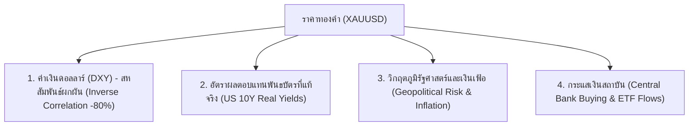
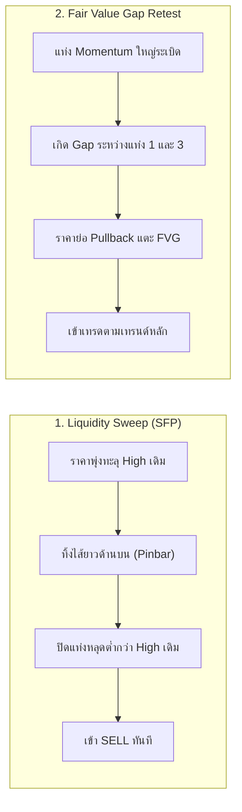
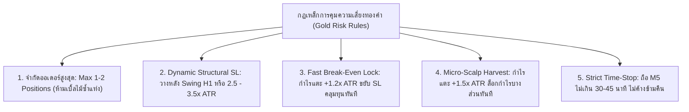

# 🥇 คัมภีร์องค์ความรู้และพฤติกรรมตลาดทองคำ (The Ultimate Gold / XAUUSD Trading Knowledge Base)

เอกสารรวบรวมองค์ความรู้เชิงลึก พฤติกรรมราคา กลยุทธ์ Price Action จิตวิทยาการเทรด และพิมพ์เขียวสถาปัตยกรรมโมเดลสำหรับระบบเทรดทองคำอัตโนมัติ (Automated Gold Trading Engine)

---

## 🧭 สารบัญเนื้อหา (Table of Contents)
1. [ธรรมชาติและโครงสร้างตลาดทองคำ (Gold Market Microstructure & Drivers)](#1-ธรรมชาติและโครงสร้างตลาดทองคำ)
2. [พิมพ์เขียวสภาพคล่องตามช่วงเวลา (Intraday Liquidity & Session Blueprint)](#2-พิมพ์เขียวสภาพคล่องตามช่วงเวลา)
3. [พฤติกรรมกราฟและ Price Action รูปแบบแท่งเทียนทองคำ (Gold Chart & Candlestick Patterns)](#3-พฤติกรรมกราฟและ-price-action-แท่งเทียน)
4. [จิตวิทยาการเทรดทองคำและกับดักที่พบบ่อย (Gold Psychology & Common Pitfalls)](#4-จิตวิทยาการเทรดทองคำและกับดักที่พบบ่อย)
5. [กฎเหล็กการบริหารความเสี่ยงและ Stop Loss (Risk & ATR Management Bible)](#5-กฎเหล็กการบริหารความเสี่ยงและ-stop-loss)
6. [พิมพ์เขียวฟีเจอร์สำหรับพัฒนา AI Gold Model (ML Feature Engineering Blueprint)](#6-พิมพ์เขียวฟีเจอร์สำหรับพัฒนา-ai-gold-model)
7. [Checklist การตรวจสอบก่อนออกคำสั่งเทรด (Pre-Trade Execution Checklist)](#7-checklist-การตรวจสอบก่อนออกคำสั่งเทรด)

---

## 1. ธรรมชาติและโครงสร้างตลาดทองคำ (Gold Market Microstructure & Drivers)

ทองคำ (`XAUUSD`) เป็นสินทรัพย์ลูกผสมระหว่าง **โภคภัณฑ์ (Commodity)**, **สกุลเงินสำรอง (Reserve Currency)**, และ **สินทรัพย์ปลอดภัย (Safe-Haven Asset)** ซึ่งมีแรงขับเคลื่อนเฉพาะตัว:

### 1.1 ความสัมพันธ์กับ Dollar Index (DXY) และ US Real Yields
* **Inverse Dollar Correlation**: เนื่องจากทองคำซื้อขายในสกุลเงิน USD เมื่อ DXY แข็งค่า ทองคำมักปรับตัวลง และเมื่อ DXY อ่อนค่า ทองคำมักพุ่งขึ้น (ความสัมพันธ์เชิงลบ ~ -0.75 ถึง -0.85)
* **Real Yields (ผลตอบแทนพันธบัตรหักเงินเฟ้อ)**: ทองคำไม่มีดอกเบี้ย (Zero Yield) ดังนั้นเมื่อ Real Yields ของพันธบัตรรัฐบาลสหรัฐฯ ปรับตัวลดลง ต้นทุนค่าเสียโอกาสของการถือทองจะลดลง ส่งผลให้ราคาทองคำพุ่งขึ้นแรง

### 1.2 สินทรัพย์ Safe Haven vs Speculative Asset
* **Panic Buying**: เมื่อเกิดสงคราม วิกฤตธนาคาร หรือความตึงเครียดทางภูมิรัฐศาสตร์ ทองคำจะเกิด Panic Inflow พุ่งขึ้นแบบไม่สนแนวต้านทางเทคนิค
* **High-Impact Macro News**: ข้อมูลเศรษฐกิจสหรัฐฯ เช่น **CPI (เงินเฟ้อ)**, **NFP (การจ้างงานนอกภาคเกษตร)**, **PPI**, และ **มติการประชุม FED/FOMC** จะทำให้ราคาทองคำผันผวนรุนแรงได้ทันที $20–$60 USD ภายใน 5–15 นาที

---

## 2. พิมพ์เขียวสภาพคล่องตามช่วงเวลา (Intraday Liquidity & Session Blueprint)

พฤติกรรมราคาทองคำขึ้นอยู่กับเซสชันของตลาดอย่างชัดเจน (อิงเวลาไทย GMT+7):

| ช่วงเวลา (GMT+7) | ชื่อเซสชัน (Session) | พฤติกรรมราคาและสภาพคล่อง | กลยุทธ์ที่เหมาะสม |
| :--- | :--- | :--- | :--- |
| **06:00 - 13:00 น.** | **Asian Session** | สภาพคล่องต่ำ วิ่งในกรอบแคบ (Range: $8–$15) ทำหน้าที่สะสมพลัง (Accumulation) และสร้าง **Asian High / Low** | รอสร้างกรอบ High/Low ไม่ไล่ราคา / เล่น Reversal ขอบบนขอบล่าง |
| **14:00 - 18:00 น.** | **London Open** | สภาพคล่องเริ่มสูงขึ้น มักเกิด **"Judas Swing"** (แกล้งทำ Breakout หลอกกิน Stop Loss เหนือ/ใต้ Asian Range) ก่อนวิ่งจริง | เล่น **Liquidity Sweep & Reversal** หรือตาม Breakout แท้จริง |
| **19:30 - 23:30 น.** | **London-NY Overlap (Golden Window)** | **ช่วงเวลาสภาพคล่องสูงสุด (Peak Volume)** ตลาดสหรัฐเปิด ประกาศข่าวเศรษฐกิจ สถาบันใหญ่ดันเทรนด์หลักของวัน | เล่น **Trend Momentum & FVG Retest** (กำไรต่อรอบสูงสุด) |
| **00:00 - 03:30 น.** | **Late NY Session** | โมเมนตัมเริ่มชะลอตัว เกิด Profit-Taking และ Reversal กลับสู่ Mean | เล่น Mean Reversion หรือปิดเก็บกำไร |
| **04:00 - 05:00 น.** | **Rollover Window** | โบรกเกอร์ปิดรอบวัน สภาพคล่องแห้ง **Spread ถ่างกว้าง 20–60 pips** | 🚫 **กฎเหล็ก: ห้ามเปิดออเดอร์ใหม่เด็ดขาด (Blocked)** |

---

## 3. พฤติกรรมกราฟและ Price Action แท่งเทียน (Gold Chart & Candlestick Patterns)

### 3.1 รูปแบบการกวาดสภาพคล่อง (Liquidity Sweep & Swing Failure Pattern - SFP)
* **พฤติกรรมเจ้ามือ (Market Maker)**: ทองคำชอบล่า Stop Loss ที่ตั้งอยู่เหนือ Swing High หรือใต้ Swing Low ของ Asian Range หรือ H1
* **ลักษณะแท่งเทียน**: แท่ง M5/M15 แทงไส้ทะลุแนวต้านแล้วถูกตบกลับอย่างรวดเร็ว (ทิ้งไส้บน/ล่างยาว $\ge 60\%$ ของแท่ง)
* **Execution**: เมื่อแท่งเทียนปิดกลับเข้ามาในกรอบเดิม ให้เปิดคำสั่ง Reversal ทันที โดยตั้ง SL อยู่เหนือปลายไส้เทียน

### 3.2 รูปแบบ Fair Value Gap (FVG) และ Imbalance Retest
* **ลักษณะ**: เมื่อเกิดข่าวหรือแรงดันสถาบัน จะเกิดแท่งเทียนเนื้อแน่น 3 แท่งที่ทิ้งช่องว่างสภาพคล่อง (Imbalance)
* **Execution**: ไม่ไล่ราคาตอนพุ่ง แต่ตั้งคำสั่ง Limit Order รอที่จุดกึ่งกลาง FVG (50% Consequent Encroachment) ร่วมกับแนวรับ EMA 21

### 3.3 รูปแบบ Flag & Wedge (Trend Continuation)
* **Bull Flag / Bear Flag**: การพักตัวในกรอบคู่ขนานมุมเอียงตรงข้ามเทรนด์หลัก หากเบรกทะลุกรอบพร้อม Volume จะวิ่งต่อเป็นระยะเท่ากับเสาธง (Flagpole)
* **Falling Wedge ในขาขึ้น**: รูปแบบลิ่มลู่ลง แสดงการอ่อนแรงของฝั่งขาย เป็นสัญญาณเตรียมดีดตัวรอบใหญ่

### 3.4 จิตวิทยาตัวเลขกลม (Psychological Round Numbers)
* ระดับราคาเลขกลมลงท้ายด้วย `$00` หรือ `$50` (เช่น `$2,500`, `$2,550`, `$2,600`) จะมี Institutional Limit Orders กองอยู่หนาแน่นเสมอ ราคามักเกิดการชะลอตัว หรือ Reject อย่างรุนแรง

---

## 4. จิตวิทยาการเทรดทองคำและกับดักที่พบบ่อย (Gold Psychology & Common Pitfalls)

ทองคำได้ชื่อว่าเป็น **"เครื่องทดสอบจิตวิทยาขั้นสูงสุด"** ของเทรดเดอร์ ข้อผิดพลาดที่ทำให้พอร์ตเสียหายบ่อยที่สุดได้แก่:

### 4.1 กับดัก FOMO (Fear of Missing Out)
* **อาการ**: เห็นแท่งทองคำสีเขียวพุ่งยาวบน M5 แล้วกลัวตกรถ จึงรีบกด BUY ตามที่ยอดดอย
* **ความจริง**: แท่งพุ่งยาวของทองคำมักเป็นจังหวะที่สถาบันปิดทำกำไร (Exiting) หรือเป็นกับดักสภาพคล่อง ราคามัก Pullback ลงมาลึกทันที

### 4.2 กับดัก Toxic Multi-Stacking / Revenge Trading (การเปิดเบิ้ลไม้แก้ทาง)
* **อาการ**: เมื่อราคาทองคำวิ่งสวนทาง เทรดเดอร์เปิดไม้เพิ่มทุกๆ $2–$3 เพื่อหวังดึงราคาเฉลี่ยกลับมาเท่าทุน
* **ความจริง**: ทองคำเมื่อเกิด Super Trend สามารถวิ่งทางเดียวได้ **$30–$80 USD โดยไม่ย่อตัวเลย** การเบิ้ลไม้จะทำให้โดนล้างพอร์ตหรือโดน Stop Loss ก้อนใหญ่พร้อมกันทุกไม้ (เหมือนที่เกิดขึ้นในประวัติเทรดวันที่ 21 ก.ย.)

### 4.3 กับดัก Asymmetric Risk-Reward Drag
* **อาการ**: รีบปิดกำไรเมื่อบวกเพียงเล็กน้อย ($2–$5) เพราะกลัวกำไรหาย แต่เมื่อติดลบปล่อยให้ลากยาวไปจนชน Stop Loss เต็มจำนวน ($15–$25)
* **ผลลัพธ์**: แม้อัตราชนะจะสูง 60–70% แต่พอร์ตจะยังขาดทุนสุทธิเพราะ "ไม้แพ้ตัวใหญ่กว่าไม้ชนะ"

---

## 5. กฎเหล็กการบริหารความเสี่ยงและ Stop Loss (Risk & ATR Management Bible)

### 5.1 การคำนวณ Stop Loss และ Take Profit ด้วย ATR
* ทองคำมีความผันผวนสูง ค่า M5 ATR เฉลี่ยอยู่ที่ **$1.50 – $4.00 USD** (15 – 40 pips)
* **สูตรวาง Stop Loss**:
  $$\text{SL Distance} = \max\Big(\$4.00,\; 3.0 \times \text{ATR}_{14}\Big)$$
  *(ห้ามตั้ง SL ต่ำกว่า $4.00 USD หรือ 40 pips เด็ดขาด เพื่อป้องกัน Market Noise)*
* **สูตรวาง Take Profit**:
  $$\text{TP Target} = \max\Big(\$6.00,\; 4.5 \times \text{ATR}_{14}\Big)\quad (\text{Minimum R:R} \ge 1:1.5)$$

### 5.2 กลไก Break-Even Lock และ Stepdown Trailing
1. **เมื่อราคาบวกถึง $+1.2 \times \text{ATR}$**: ขยับ SL มาที่ราคาเปิดทันที ($\text{Entry} + 0.3\times\text{ATR}$ คลุมค่าสเปรด) เพื่อตัดความเสี่ยงให้เหลือ 0%
2. **เมื่อราคาบวกถึง $+1.5 \times \text{ATR}$**: สามารถแบ่งปิดทำกำไร (Micro-Scalp Harvest) หรือเริ่มรัน Trailing Stop ตาม EMA 9

---

## 6. พิมพ์เขียวฟีเจอร์สำหรับพัฒนา AI Gold Model (ML Feature Engineering Blueprint)

เพื่อยกระดับระบบเทรดทองคำจาก Heuristic Scorer สู่ **Dedicated Machine Learning Model (LightGBM / GBDT Ensemble)** แนะนำให้สกัดและจัดเก็บ 12 Features ดังต่อไปนี้:

| ลำดับ | ชื่อฟีเจอร์ (Feature Name) | ประเภท | คำอธิบายและความสำคัญต่อโมเดล |
| :---: | :--- | :---: | :--- |
| **1** | `session_kind` | Categorical | `ASIAN` (0), `LONDON_OPEN` (1), `LONDON_NY_OVERLAP` (2), `LATE_NY` (3) |
| **2** | `asian_sweep_high` | Binary | `1` เมื่อราคาทำ High สูงกว่า Asian High แต่ปิดต่ำกว่า (Liquidity Grab) |
| **3** | `asian_sweep_low` | Binary | `1` เมื่อราคาทำ Low ต่ำกว่า Asian Low แต่ปิดสูงกว่า (Liquidity Grab) |
| **4** | `dxy_m5_slope` | Continuous | ความชันและการเคลื่อนไหวของดัชนี DXY ในรอบ 5 แท่งล่าสุด (เช็คสหสัมพันธ์ผกผัน) |
| **5** | `h1_trend_slope` | Continuous | ความชันของ EMA 50 บน Timeframe H1 เพื่อบังคับเทรดตามเทรนด์ใหญ่ |
| **6** | `atr_m5_to_daily_ratio` | Continuous | อัตราส่วน $\text{ATR}_{\text{M5}} / \text{ATR}_{\text{Daily}}$ วัดการขยายตัวของ Volatility |
| **7** | `bb_width_pct` | Continuous | ความกว้างของ Bollinger Bands วัดภาวะ Squeeze ก่อนเกิดการ Breakout |
| **8** | `volume_ratio_20` | Continuous | สัดส่วน Volume แท่งปัจจุบันเทียบกับค่าเฉลี่ย 20 แท่งย้อนหลัง |
| **9** | `dist_to_round_num_atr` | Continuous | ระยะห่างของราคาปัจจุบันจากระดับราคาเลขกลม ($50/$100) วัดเป็นเท่าของ ATR |
| **10** | `rsi_14_m5` | Continuous | ค่า RSI บน M5 เพื่อระบุภาวะ Momentum และ Overbought/Oversold |
| **11** | `fvg_distance_atr` | Continuous | ระยะห่างจากแนว Fair Value Gap ล่าสุด |
| **12** | `spread_to_atr` | Continuous | อัตราส่วนค่า Spread ต่อ ATR (ต้อง $\le 0.35$ จึงจะอนุญาตให้เข้าเทรด) |

---

## 7. Checklist การตรวจสอบก่อนออกคำสั่งเทรด (Pre-Trade Execution Checklist)

ก่อนที่ระบบหรือเทรดเดอร์จะส่งคำสั่ง XAUUSD ทุกครั้ง ต้องผ่านเกณฑ์ประเมินทั้ง 6 ข้อนี้:

- [ ] **1. Session Check**: อยู่ในช่วงเวลา **London Open (14:00-18:00)** หรือ **London-NY Overlap (19:30-23:30)** หรือไม่? *(ไม่อนู่ในช่วง Rollover 04:00-05:00 น.)*
- [ ] **2. News Filter**: ไม่มีข่าว High-Impact (CPI, NFP, FOMC) ภายใน $\pm 15$ นาทีของการเข้าเทรด
- [ ] **3. Macro Alignment**: ทิศทางของสัญญาณสอดคล้องกับแนวโน้ม DXY (BUY Gold เมื่อ DXY ลง / SELL Gold เมื่อ DXY ขึ้น)
- [ ] **4. Setup Confluence**: มีรูปแบบ Liquidity Sweep หรือ EMA Pullback หรือ FVG Retest ชัดเจน
- [ ] **5. Position Limit**: ปัจจุบันไม่มีออเดอร์ทองคำค้างอยู่เกินโควตา (Max 1 ไม้) และไม่ใช่ออเดอร์ซ้ำในแท่ง M5 เดียวกัน
- [ ] **6. Risk-Reward Ratio**: ระยะทางไปถึงแนวรับ/แนวต้านถัดไป คุ้มค่าความเสี่ยง ($\text{R:R} \ge 1:1.5$ และ $\text{Target} \ge 2.5\times\text{ATR}$)
